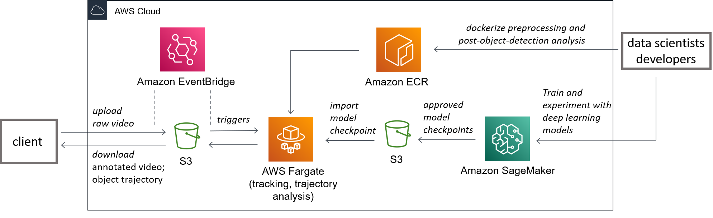

# Track pedestrian trajectories for space usage planning
Deploy multi-object tracking deep learning models on AWS to analyze pedestrian tracjectories

## Overview

## Methods
* Two-step online method: YOLOv3 + SORT
* One-shot deep learning method: FairMOT
[ifzhang/FairMOT](https://github.com/ifzhang/FairMOT)
> [**FairMOT: On the Fairness of Detection and Re-Identification in Multiple Object Tracking**](http://arxiv.org/abs/2004.01888),            
> Yifu Zhang, Chunyu Wang, Xinggang Wang, Wenjun Zeng, Wenyu Liu,        
> *arXiv technical report ([arXiv 2004.01888](http://arxiv.org/abs/2004.01888))*

## Performance
### Two-step online method: YOLOv3 + SORT

### One-shot deep learning method: FairMOT
<video width="320" height="240" controls>
  <source type="video/mp4" src="assets/shopping-mall2-results-ct03dt03.mp4">
</video>

## Next to implement
* Project pedestrian trajectories onto 2D floor plans.
* Post-process trajectories (e.g. fix inaccurate re-id over frames)

## Acknowledgement
